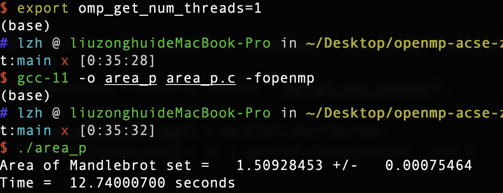
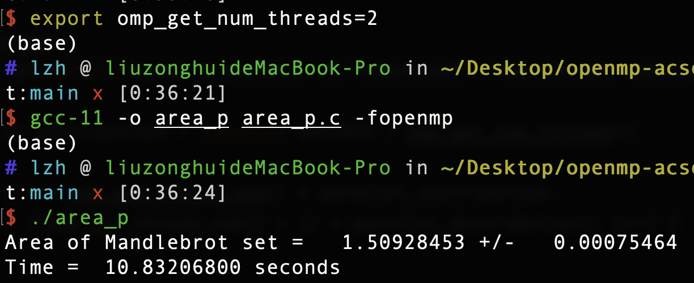
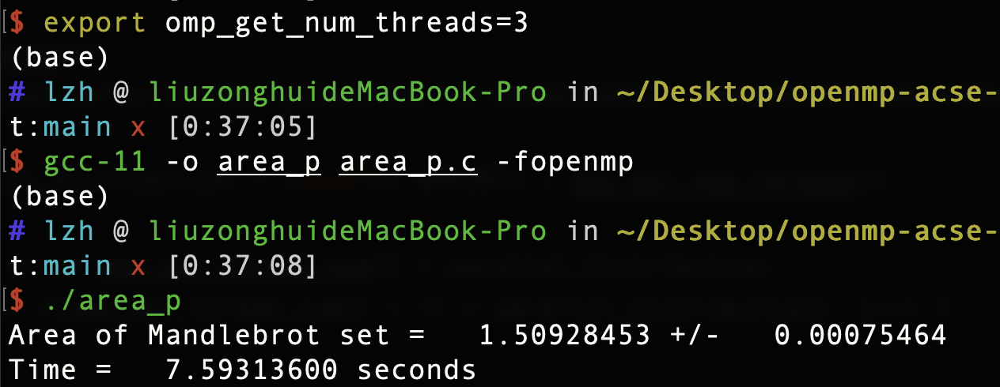
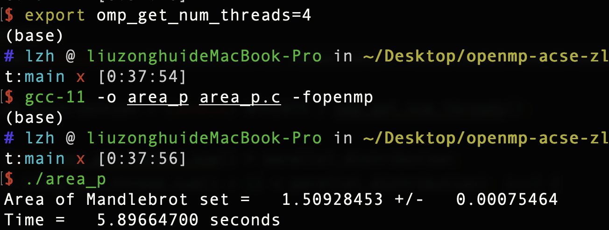
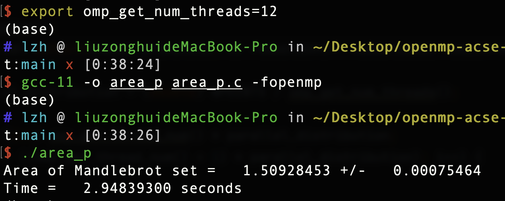

# Assignment 2: Area of the Mandelbrot Set

## The Environment

- Processor: 2.2 GHz 6-Core Intel Core i7
- Logical cores/threads: 12
- OS: macOS Monterey 12.1
- gcc version: 11

## Quick Start

The code to estimate the area of the Mandelbrot set in parallel is in the file called `area_p.c`. I used 1, 2, 3, 4, 12(max) thread(s) respectively to compute the area. The command I used in my terminal is:

set the number of threads: 

`export OMP_GET_NUM_THREADS=1/2/3/4/12`

compile:

`gcc-11 -o area_p -fopenmp area_p.c`

excute:

`./area_p`

## The Parameter

- z and c are private in the parallel region

- numoutside is reduction: we can get the value from each thread and add them at the end

## The Result

## Finding

- Regardless of the number of threads, the result is the same as the result using single thread.(area = 1.50928453)

- The more the number of threads used in the parallel region, the less the running time the machine used and the higher efficiency we got. (over 4x better performance compared the single one to the 12 threads one)

- However, it is hard to find the a multiplicative relationship between them.

