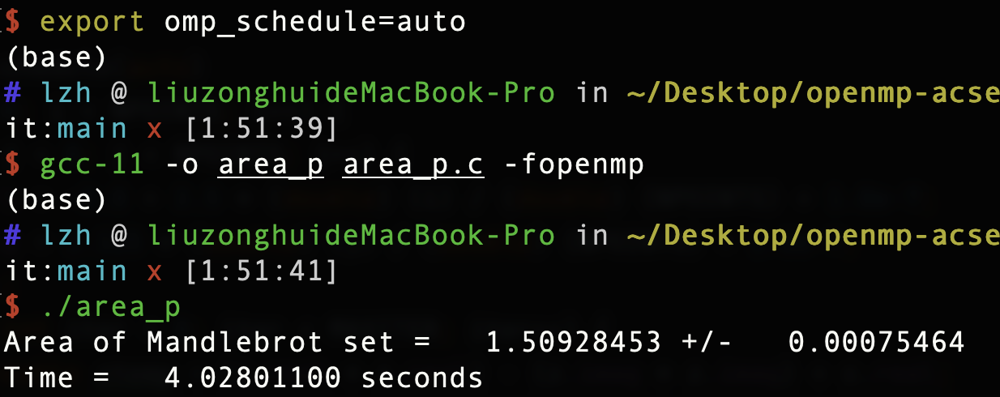
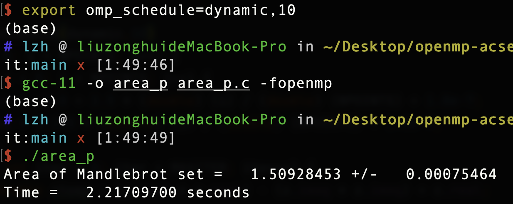
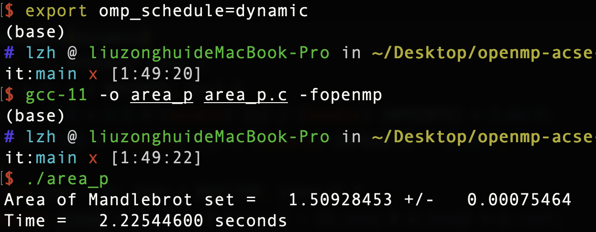
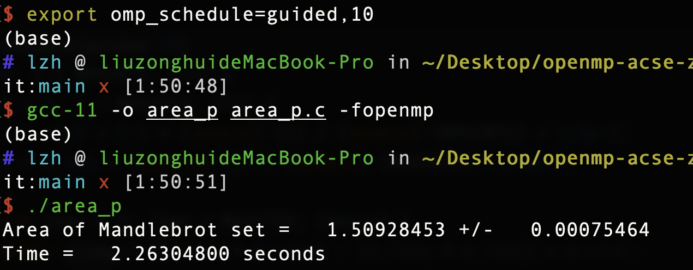
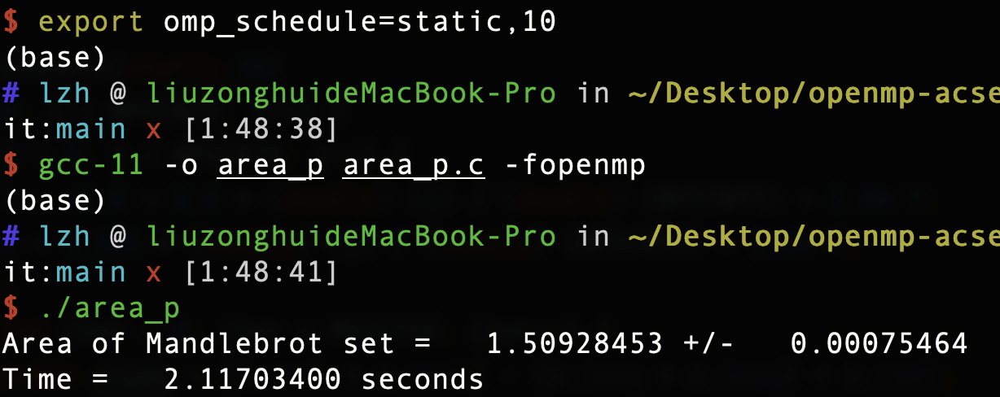
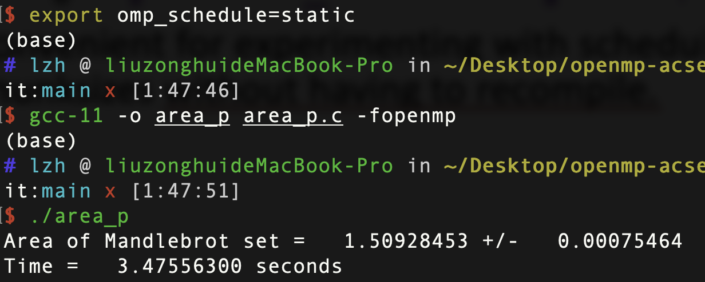

# Assignment 3: Area of the Mandelbrot Set（Parallel for)

## The Environment

- Processor: 2.2 GHz 6-Core Intel Core i7
- Logical cores/threads: 12
- OS: macOS Monterey 12.1
- gcc version: 11

## Quick Start

The code to estimate the area of the Mandelbrot set in parallel is in the file called `area_p.c`. The kinds of schedule I used are auto, dynamic, dynamic10, guided10, static and static10. And the number of threads I used is 10. The command is:

set the sechdule(environment variables): 
eg. the static schedule with the chunksize=10

`export omp_schedual=static,10`

compile:

`gcc-11 -o area_p -fopenmp area_p.c`

excute:

`./area_p`

## The Parameter

- z and c are private in the parallel region

- numoutside is reduction: we can get the value from each thread and add them at the end

## The Result

## Finding

- Regardless of the kind of schedule, the results are the same.(area = 1.50928453)

- The efficiency: auto < static < guided,10 < dynamic < dynamic,10 < static,10

- The reason(with chunksize is faster than that without the paramether) I guess: since I used 10 threads, when I set the chunksize=10, the load and iteration is smooth and balanced, which means the master thread can use less time to wait the other threads at the end of the parallel region(barrier).

-  The reason(dynamic is faster than static) I guess: the dynamic one is first-come-first-service, which means it can use less time to wait for a thread.

