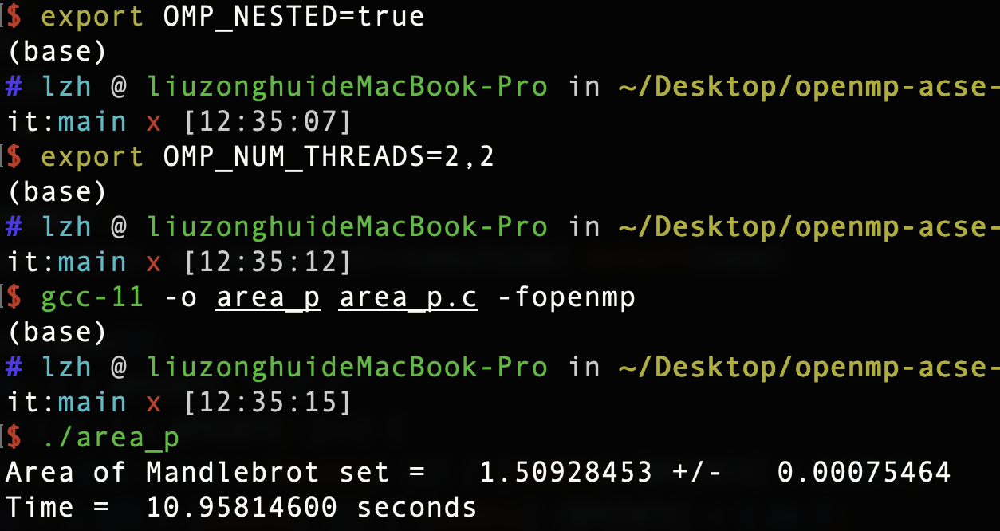
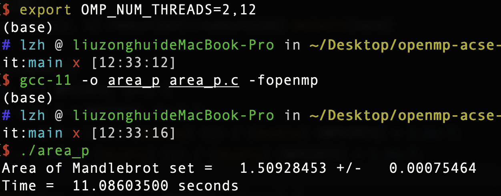
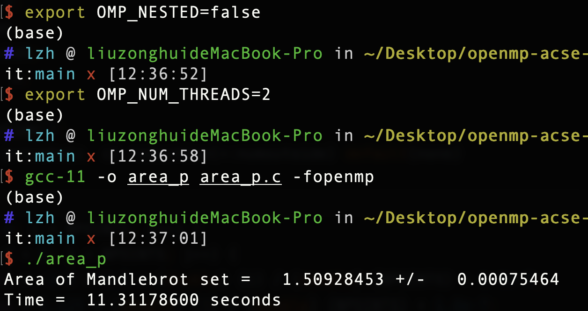
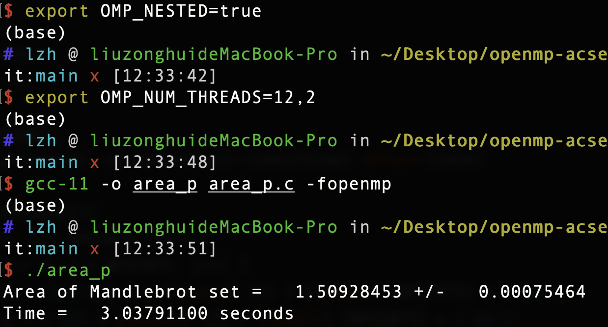
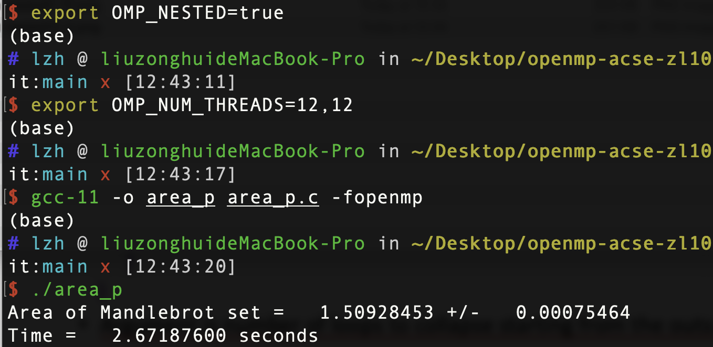
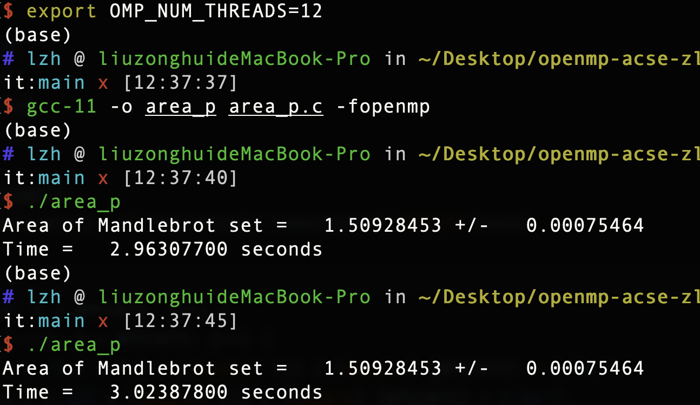

# Assignment 4: Area of the Mandelbrot Set（Nested Parallelism)

## The Environment

- Processor: 2.2 GHz 6-Core Intel Core i7
- Logical cores/threads: 12
- OS: macOS Monterey 12.1
- gcc version: 11

## Quick Start

The code to estimate the area of the Mandelbrot set in parallel is in the file called `area_p.c`. The nested parallelism(2-12, 12-2, 2-2, 12-12) and the one level of parallelism(2 and 12) have been tested. The command is:

set the nested flag(environment variables): 

`export OMP_NESTED=true/false`

set the number of threads every level used:
eg. 
`export OMP_NUM_THREADS=2,12`

compile:

`gcc-11 -o area_p -fopenmp area_p.c`

excute:

`./area_p`

## The Parameter

- z and c are private in the parallel region

- numoutside is reduction: we can get the value from each thread and add them at the end

## The Result

## Finding

- We can see that the running time of nested2-12 and nested2-2 are similar and much longer than that of nested12-2. Therefore, we can roughly summarise that the efficiency is mainly influenced by the number of threads allocated to the outer loop. 

- We can also see that the running time of nested2-2/nested12-12 and that of one level loop2/12 are similar. 

- The reason(the number of outer threads has more impact) I guess: since after the inner loop has been done, our code will jump to the outer loop. Therefore, the efficiency will always be constrained by the speed of the outer loop.

-  The reason(12-12 is similar as one-loop-level-12) I guess: for the nested loop using one-loop-level, the inner loop actually uses the outer allocated threads by default.

