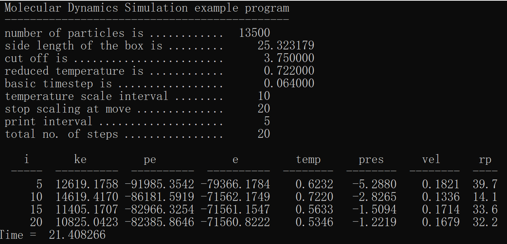
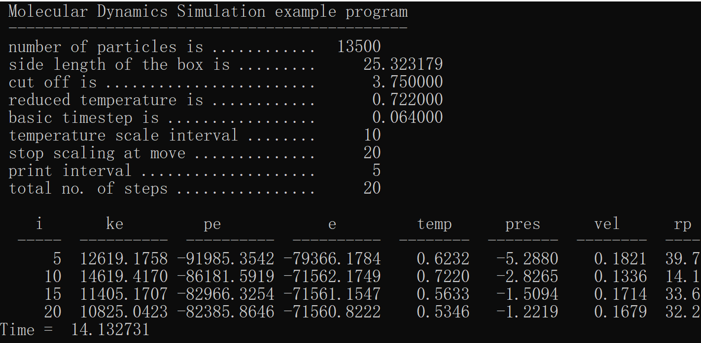
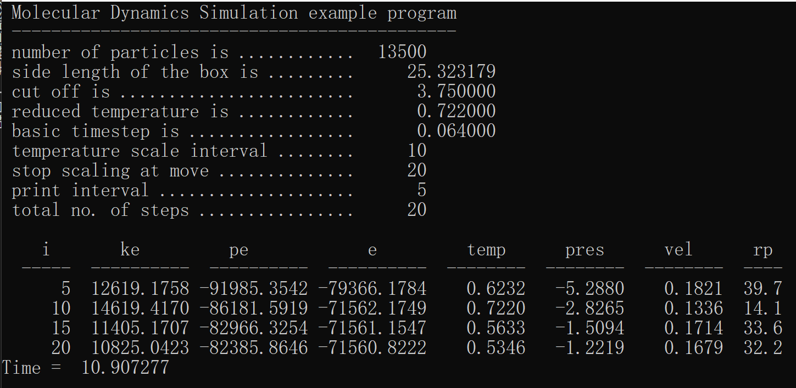
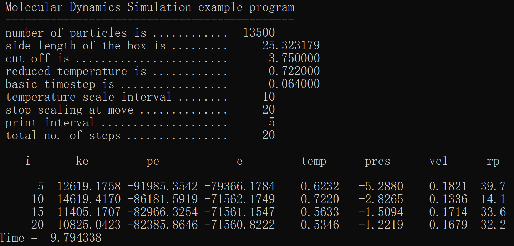

# Assignment 5: Molecular Dynamics

## The Environment

- Processor: 2.70 GHz 2-Core Intel Core i5-5257U
- Logical cores/threads: 4
- OS: Windows 10
- Visual Studio Community 2022

## The Parameters

- **Shared**: `f` and `x`, because they will be used outside.
- **Reduction**: `epot` and `vir`, they represent the virial and potential energy, which will be summed(positive and negtive) at the end of the parallel region.
- **firstprivate**: `side`, `sideh`, `rcoffs` and `npart`. They are used to compute the `epot`, `vir` and forces, however, they can't be initialises(original values) if they are set `private`.
- num_threads: `omp_set_num_threads(1/2/3/4);`
- schedule: static

## Why Critical

- A critical section is a block of code which can be executed by only one thread at a time.
- In our situation, take the force as an example, it is the force between a partial and others. If we don't use critical, the shared variable will be overwritten and finally a wrong result.

## The Result

## Finding

- The results are independent of the number of threads we used in the parallel region.

- The more threads we used in the parallel region, the less time will be spent(the better performance will be got).

